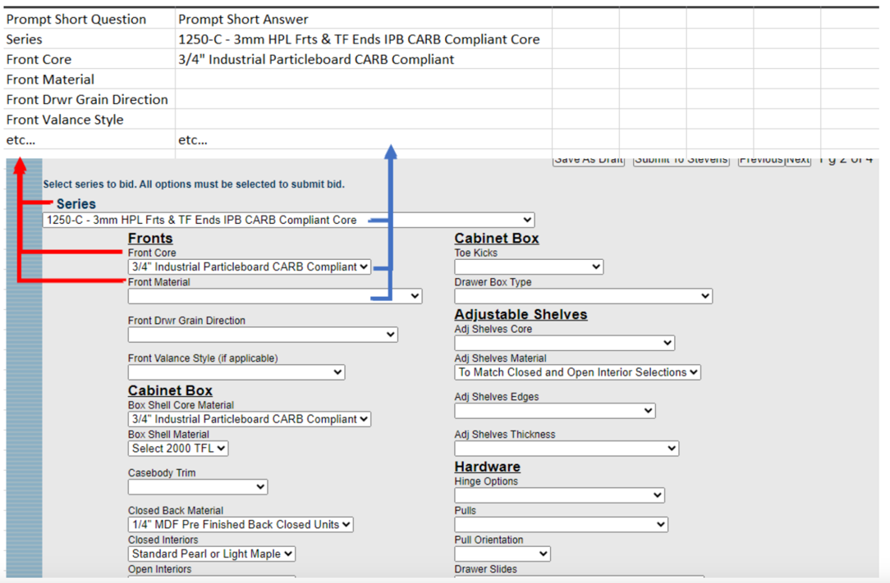

+++
title = 'Data Mining for BidRequest Solution Proposal'
date = 2024-10-18T11:39:36+03:00
draft = false
author = 'Iryna Mykytyn'
+++

# Data Mining for BidRequest Solution Proposal

## Objective
We need to integrate a solution that reads the specification (provided as PDFs) and applies business-specific logic to help output the information, such as that provided in the screenshots (found on pages 2 and 3 of 4: [Stevens Industries, Inc. - Bid Request](https://bid.stevensind.com/)). This need is detailed in the [Keyword Strategy proposal document](https://docs.google.com/document/d/1-pfgHV9S3QRp4H1dnRuF4xZ41p07Yhom/edit).
It was proposed that LLMs like GPT be used to solve this problem.

## Manual Approach and Discovered Bottlenecks
To solve the problem manually, I followed these steps:

1. **Initial Guidance:**
I asked Curtis for an example of how an expert would approach the problem. He provided a [recording](https://drive.google.com/file/d/1KXhfdK2S4zZN5gHBx9IYPK8Z2C3YtqTK/view?usp=drive_link) with an explanation and the first [example specification](https://drive.google.com/file/d/1T8lXJC9J-YL_DExG--HDt1sg-IuE-RAK/view).

2. **Prompt Development:**
I extracted all options from the HTML page of [BidRequest](https://bid.stevensind.com/) and used [ChatCraft](https://chatcraft.org/) with GPT-4o to create a JSON containing the series options and other details explained and the initial prompt. See the example of the prompt [here](https://chatcraft.org/c/iramykytyn/QZdALIN2i0MAGQEbU3WhJ).
I followed [this research](https://arxiv.org/pdf/2406.06608) to try different prompt engineering techniques with different models. I ended up with the initial prompt that worked for the example provided by Curtis, but I needed to test its generalization with more specifications.

3. **Model Experimentation:**
I used [OpenRouter](https://openrouter.ai/) chat to run the same prompt with models like GPT-4o, Claude-Sonet-3.5, and Gemini. This helped filter out unsuitable models, leaving GPT and Claude as viable options. The image below demonstrates OpenRouter’s UI providing simultaneous responses.

4. **Additional Examples:**
Curtis provided eight more examples with short explanations from an expert on how to define the series. Testing with the same prompt revealed that the prompt logic did not support most of the new specifications, necessitating prompt instruction improvement.
5. **Instruction Definition:**
I reviewed the expert's explanations to define step-by-step instructions that represented the business logic followed by an expert.

    This process became a bottleneck, taking days of experimentation and manual reruns to achieve 60-80% precision. The results were documented in a [spreadsheet](https://docs.google.com/spreadsheets/d/1KH6cHkVhdanJFwELvNIQ6dFiXixRb9sEa8lnhRGXHzs/edit?pli=1&gid=0#gid=0). 

    There still were some gaps in LLM reasoning and validation or improvement of it required now much more manual work than it was for one initial example. Also, I started noticing some randomness in LLM evaluation, which introduced more space for uncertainty regarding my evaluation results

6. **Prompt Refinement:**
Minor changes to the prompt required significant time (30-60 minutes) to evaluate new results on nine examples from the dataset. This was the first severe bottleneck. When new tests failed, I asked the LLM to explain the logic and identified gaps in the instructions. Then I went to consult with the Expert in comments Specification Examples, trying to resolve conflicting instructions. It was the second big bottleneck since I needed to wait for Expert’s responses, and when I finally got it, it usually conflicted with some other logic explained before, so I needed to ask more questions or try to educate myself with internet materials, and that process seemed neverending. 

7. **Tool Development:**
To address the first bottleneck, I started to work with Yaroslav (our Junior Python engineer) on our internal LLM research project. He helped to build a Python script with a UI in Streamlit, allowing us to rerun evaluations on the entire dataset with one click. This tool enabled more prompt experiments, improving precision to ~85% on our dataset. More experiments are documented in this [blog](https://coxit-co.github.io/dont_trust_ai/) and on this [project board](https://github.com/orgs/COXIT-CO/projects/8).

8. **Data Pipeline:**
After achieving satisfactory precision (see the best prompt and its results for different LLMs [here](https://docs.google.com/spreadsheets/d/17O13XsgppURcF_KNEKQHunvl5XqPnYGO_xWYeGTT5Iw/edit?gid=1703331718#gid=1703331718)), we needed more data because only a few of the series were tested in the current example. Considering how long it took to gather the current data set and talk to experts to develop instructions for it, we realized the necessity of a pipeline for data gathering, feedback, and evaluation reruns. We needed the tool to support this pipeline. Although Yaroslav's script automated a lot, it was still raw and buggy. We decided not to develop it further ourselves, knowing there are existing tools on the market. We investigated these tools, as detailed in this [investigation](https://coxit-co.github.io/dont_trust_ai/posts/comprehensive_frameworks_evaluation/comprehensive-frameworks-evaluation-post/).

The entire process took approximately three months of work for Yaroslav (Junior Python Engineer). It also required about five months of part-time work for me, involving 5-15 hours per week. Curtis and the Expert probably spent a similar amount of time with me providing datasets and explanations. Those steps led me to the following conclusion.

## Conclusion
The research concluded with these insights:

- **Streamlining Data Set Evaluation Need**: Building a dataset and running automated evaluations is time-consuming. Working with spreadsheets is time-consuming too. We need to streamline this process using tools like LangSmith and DeepEval. 
- **Problem with Extracting Expert Knowledge**: This is a significant bottleneck. We need to facilitate experts in sharing their knowledge in an analyzable format, collected in one place. An AI agent to upload more examples, with an integrated feedback loop and tools like LangSmith or DeepEval for data collection and annotation, should help.
- **Lack of Standardized Knowledge Base**:  Solving these two problems may also address the challenge of building a standardized knowledge base for future expert training.

Based on that conclusion, the following Solution Proposal was developed.

## Solution Proposal

Automate the manual pipeline with the following steps:

### Step 1: Build PoC of AI Agent Integrated into AutoScan
AI Agent is the chat that appears when the user opens the uploaded PDF specification. It gives the User a list of Predefined questions. The User picks one of the questions and receives an answer in the chat. User feedback the answer.

**Predefined questions (instructions)** are questions created by Admin. Every question must reference an Instruction that will be used as a core of the Prompt for LLM. 

The whole user story is [here](https://docs.google.com/document/d/1GK2aGxpWFuy_uRoSL7vb9RbfHNEUxjhcX73x9VX2Y3s/edit?tab=t.0#heading=h.9w9vxgrss67r).
This step will let us facilitate experts in sharing their knowledge, but it should also create enough value for an Expert to engage them to upload specifications and provide feedback.

### Step 2: Build Base Prompts and Basic Data Sets
- **Base Prompts**: Admin and Prompt Engineer will need to work together to create an Instruction.
Instruction is the core of the Prompt. Here is an example of a Prompt template:

    

    Base Prompt is a prompt which gives at least 80% precision on Basic Data Set
    The proposed path is to start from building 2-3 Basic Prompts to extract data for a few BidRequest blocks. For example, to mine data blocks separately for Series, Fronts, and Cabinet Box.
    The proposal is to extract the data by blocks so as not to have too many separate instructions for each field of BidRequest.

    
    
    
- **Basic Data Set**: a small (~10 examples) data set annotated manually by an Expert Annotator. An example of such a Data Set is [one created for a Series](https://docs.google.com/spreadsheets/d/1KH6cHkVhdanJFwELvNIQ6dFiXixRb9sEa8lnhRGXHzs/edit?pli=1&gid=2115122249#gid=2115122249):

    
    
    **Link to PDF file** - PDF file examples with explanations for Series data search and without explanations are provided [here](https://drive.google.com/drive/folders/1plAxDjeHE0SQ4tnaQa5kie7HUC7_Crpy) and linked in the first column of the table.
    **Extracted Materials Specification** - manually copy-pasted text from the section of the document where Bidder would look for materials specification needed to identify Series. We will need to develop the algorithm how to find and extract this part programmatically. For PoC we might just search the whole section specified by specific section number as noted in User Story.
    **Answer** - the series that was picked by the Annotator as the correct one for this specification. 
    For series, the Answer can be just a Label, but for the Fronts and Cabinet Box, it could be JSON representing all the fields. I don’t want us to develop separate prompts for each field for now since it will require a lot of calls to LLM and will complicate the logic. But I don’t exclude we might want to go that way later. 

### Step 3: Build Data Set Collection and Evaluation Pipeline
This step is to integrate tools like LangSmith, DeepEval or DeepStructure to track LLM requests and collect user feedback - monitor user interaction with LLM. We have shared an investigation as a [blog post](https://coxit-co.github.io/dont_trust_ai/posts/comprehensive_frameworks_evaluation/comprehensive-frameworks-evaluation-post/) comparing such tools. We will still need to decide which one to use for this project. We should probably integrate more than one for better comparison and decide which is better for our needs later.
This step will let us start solving the data set evaluation botelneck. 

### Step 4: Give It to Users
At this point, AutoScan Internal Users or Admin will be able to upload more PDF Specification examples, ask predefined questions, and leave feedback.
Once we have more examples, we will go to our monitoring system and review them. We will be able to give access to the Annotator, who will help us go through examples, provide correct answers, and then we will add more data to the Data Set (which should make it not Basic anymore). 

### Step 5: Improve Instructions, Add More Instructions
Having feedback from users will help us improve the Instructions (Prompt). -> Having more data in the Data Set will let us be more confident about our Prompt evaluation. -> Having the two above will help us speed up the creation of new instructions to extract the rest of the data for BidRequest, like Instructions to mine data to populate Adjustable Shelves, Hardware, Countertops fields.
This step will let us start solving the problem of Expert Knowledge collection and let the Users benefit more from the system receiving more precise responses.

### Step 6: Implement Oneshot CSV Export
When we get to the point where we observe acceptable precision (I guess it would be about 80% for the Data Set of size 50-100 examples, but we will see), then we should be able to create one combined instruction which would let to provide all the BidRequests info as a table and let the User export it as a CSV similar to one displayed on the screen below.  

## Links
- [Google Drive Folder of The Project](https://drive.google.com/drive/folders/15OfKbjvCcoAWPqClcqYk2ezD8qBDHCG8)
- [Specification Examples](https://drive.google.com/drive/folders/1plAxDjeHE0SQ4tnaQa5kie7HUC7_Crpy?usp=drive_link)
- [Series Quick Reference](https://drive.google.com/drive/folders/15OfKbjvCcoAWPqClcqYk2ezD8qBDHCG8)

- [Master Bid Request File](https://docs.google.com/spreadsheets/d/13Zkjs1wC-AnzjpcGvZWo_4N7TYjTNwssYeBlRiPfZG4/edit?gid=495793291#gid=495793291) - the file provided by Curtis recently with the purpose to speedup up Instructions development. Unfortunately, I didn’t have a chance to work with this doc. You will need to analyze whether its helpful when work on Instructions development with Curtis

- [Figma with UI/UX for AI Bot](https://www.figma.com/design/7MlTMm3XW5BXirKYNCm2L9/Stevens-Inc.-AutoScan-%5BApp%5D-%7BNorml%7D-2.0?node-id=3439-251397&node-type=canvas&t=bEKX5yAX7VGHO3C8-0)
- [Best Prompt for Series](https://docs.google.com/spreadsheets/d/17O13XsgppURcF_KNEKQHunvl5XqPnYGO_xWYeGTT5Iw/edit?gid=1703331718#gid=1703331718)

