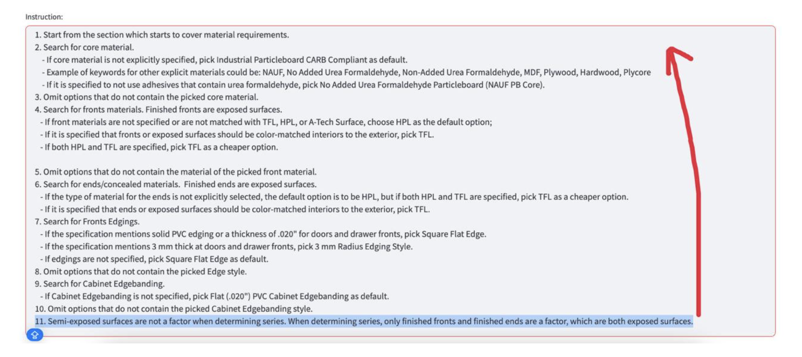
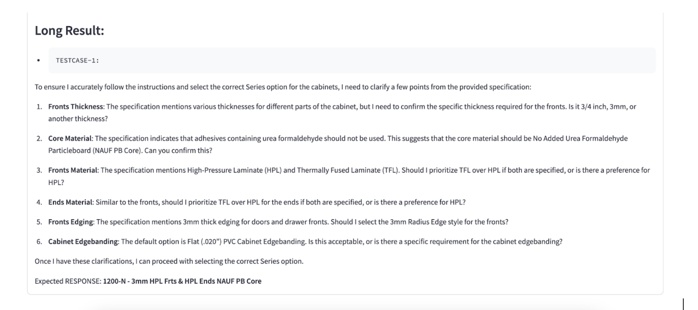
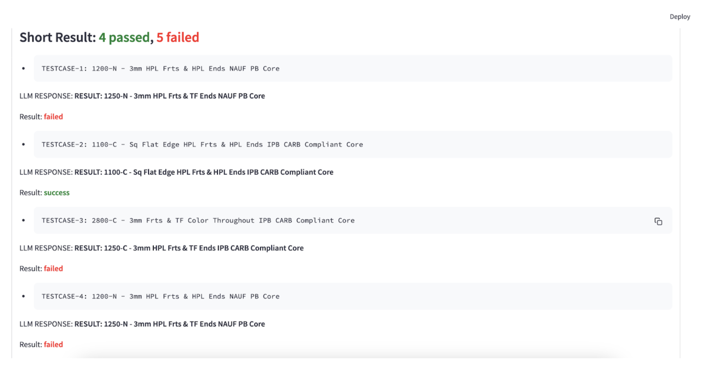
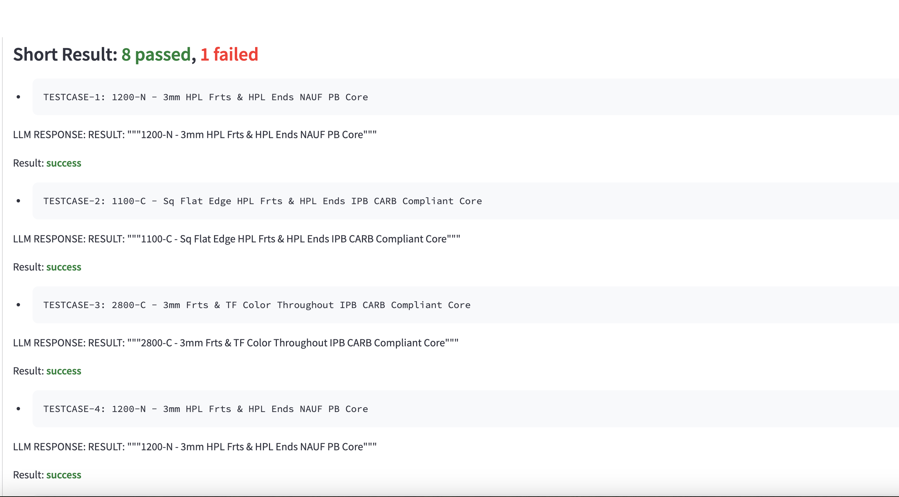
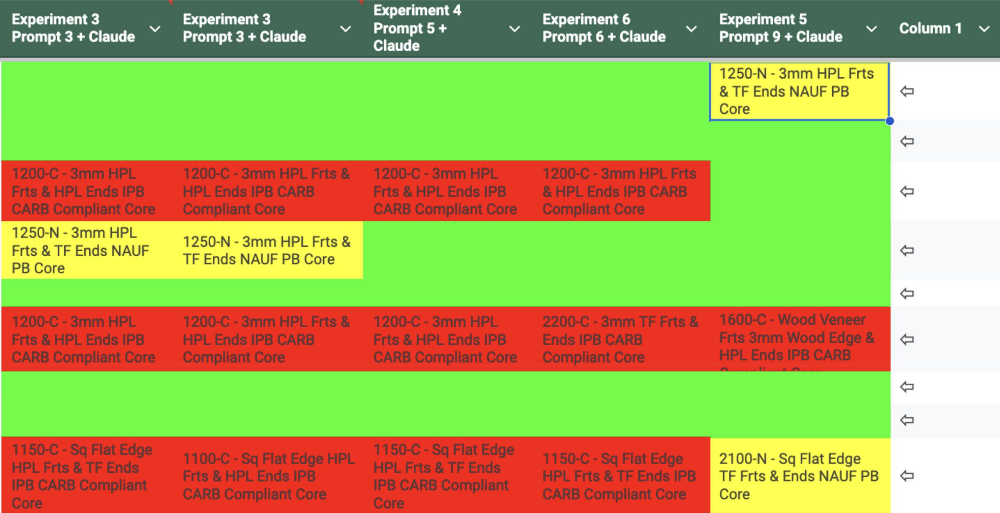

+++
title = 'Prompt Engineering through Structured Instructions and Advanced Techniques'
date = 2024-10-10T11:59:14+03:00
draft = false
author = 'Yaroslav Biziuk'
+++

[Prompt Engineering through Structured Instructions and Advanced Techniques is described on Google Docs with photo exapmles](https://docs.google.com/document/d/10pz3nPghcG3tyN9RuzrNerfcbeP59kq1YJRXjBApTQY/edit)

# 1. Introduction
Language models (LLMs) are powerful tools for a variety of tasks, but their effectiveness is highly dependent on the design of prompts. This article examines advanced techniques in prompt engineering, focusing on the impact of instruction order, the "Ask Before Answer" technique, and the "Chain of Thoughts" (CoT) method, etc. By optimizing these factors, we can significantly enhance the accuracy and reliability of LLM outputs.

# 2. The Importance of Instruction Order
Instruction order plays a crucial role in prompt engineering. Altering the sequence of instructions or actions can drastically change the outcome produced by the LLM. For instance, when we previously placed an instruction about not considering "semi-exposed surfaces" as the eleventh step, the LLM would still process these surfaces as it followed each step sequentially, reaching the exclusion instruction too late to apply it effectively. However, when this instruction was moved to precede all other steps, the LLM correctly disregarded "semi-exposed" surfaces. This demonstrates the necessity of positioning general concepts or definitions above the specific step-by-step instructions, ensuring they are applied throughout the process.

Example:


# 3. The "Ask Before Answer" Technique
The "Ask Before Answer" technique is particularly effective when optimizing prompts to reduce the occurrence of hallucinations. By prompting the LLM to seek clarification before resolving a task, we can preempt misunderstandings that might lead to incorrect answers.

**Example Prompt:**

```
You are a Casework expert. You review the specification and follow the instruction to pick the correct Series option which represents cabinet materials and thickness:

OPTIONS: {OPTIONS} 

INSTRUCTION: {INSTRUCTION}

SPECIFICATION: {INPUT_TEXT}

If you have questions or misunderstandings, ask about it before resolving the task. 
Before proceeding with the itinerary, please ask for any clarifications or additional details. 
I will give more info if you need.
```
**Result:**


When applying this technique, we ask the LLM to identify specific areas where it may be uncertain or confused in resolving a test case. By doing so, we can pinpoint where hallucinations occur, understand why the LLM struggles with certain choices, and refine the prompt in those areas where the model tends to get confused. This method is highly effective in improving the quality of the instructions provided in the prompt.

# 4. The Chain of Thoughts (CoT) Technique

**Result without CoT:**


One of the most critical steps in creating an effective prompt with complex instructions is the use of the Chain of Thoughts (CoT) technique. By including phrases like "You think step by step," "Take your time," or "Explain every step," the LLM is given time to reflect and process all input data. This approach significantly improves the results, making them more logical and coherent. However, caution is needed when using "Explain every step," as the LLM can sometimes provide the most likely correct answers without fully understanding why, leading to hallucinations.

**Result with CoT:**


# 5. Meta-Prompting: An Advanced Strategy in Prompt Engineering
Meta-prompting is an advanced technique in prompt engineering that goes beyond merely guiding a language model (LLM) through a task. It involves crafting prompts that instruct the model on how to think or approach a problem before the primary task begins. This strategic layer of prompting enhances the LLM's ability to navigate complex instructions by embedding a meta-level understanding of the task at hand. For example, instead of directly asking the LLM to solve a problem, a meta-prompt might instruct the model to first assess whether it fully understands the task, identify potential ambiguities, and request clarification if necessary.

When applied in Claude LLM, meta-prompting proved to be more effective than in GPT models. It significantly improved test case outcomes by making instructions simpler and clearer for the model to understand. Claude's advanced processing capabilities allowed it to better interpret and act on the meta-prompts, leading to more accurate and consistent results.

**Example how meta-prompting optimized Claude outputs:**


However, in our specific case, meta-prompting did not lead to the exceptional results we had hoped for. While it is a valuable technique, its effectiveness can vary depending on the complexity of the task and the model's inherent capabilities.

# 6. Explanatory Instructions
One key insight in optimizing prompt engineering is the importance of providing explanations for why certain choices should be made. Adding reasoning behind instructions helps LLMs make better-informed decisions, thereby improving their overall performance.

**For example:**

- **Worse:** "If both HPL and TFL can be used, choose TFL."
- **Better:** "If both HPL and TFL can be used, choose TFL as the more cost-effective option."

In the "better" example, the LLM is not only told which option to choose but also why that choice is preferable. This additional context helps the model understand the underlying logic and apply it more consistently across different scenarios.

# 7. Simplify Your Instructions
When writing instructions for LLMs, it’s crucial to keep them clear and simple. If people find it hard to read and understand the instructions, the model will struggle even more. Use plain language and short sentences, as if you’re explaining things to a child.

For instance:

- **Worse:** "If front materials are not specified or not matched with TFL surfaces, HPL, or A-Tech Surface, choose HPL as the default option."
- **Better:** "If fronts are not specified, default to HPL unless TFL or A-Tech Surface is mentioned."

In the "better" example, the instructions are straightforward and easier to understand.

# 8. Imagine You're Training a Colleague
When crafting prompts, it's essential to approach the task as if you are training a child or a new colleague at work to complete a specific task. To achieve this, you need to provide the individual with sufficient context and detailed, clear instructions.

# 9. The Role in Prompting
An important aspect of creating effective prompts is assigning a specific role to the language model (LLM). This role definition helps limit the data the LLM will use to solve the task and sets the appropriate tone and format for the response.

**Example:**

- **Worse:** "You are a Casework expert."
- **Better:** "You are a Casework expert tasked with reviewing a specification and selecting the correct Series option that represents cabinet materials and thickness."

This role-based approach provides the LLM with a clear context and specific guidelines, which positively influences the accuracy and relevance of the model's responses.

# 10. Conclusion
In prompt engineering, the careful structuring of instructions, along with techniques like "Meta-prompting" and "Chain of Thoughts," can dramatically enhance the performance of language models. These methods help in reducing hallucinations, improving clarity, and ensuring more accurate outcomes.

# 11. References
- [Prompt Engineering for ChatGPT: A Comprehensive Guide](https://medium.com/@seyibello31/prompt-engineering-for-chatgpt-a-comprehensive-guide-6650cdf0a047)
- [The Prompt Report: A Systematic Survey of Prompting Techniques](https://arxiv.org/pdf/2406.06608)
